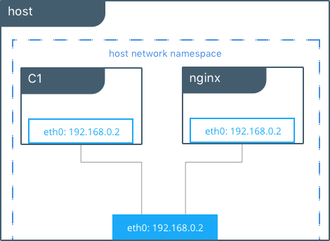
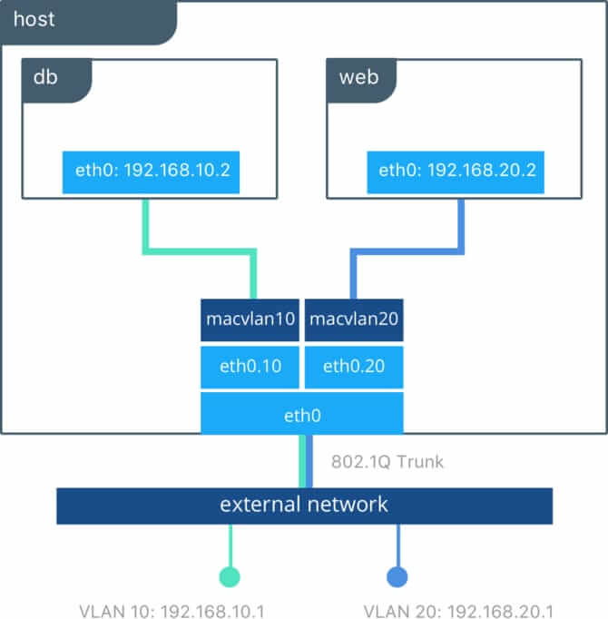

# Beginning 

## 1. Installation 

```bash
sudo apt-get update

sudo apt-get install \
    ca-certificates \
    curl \
    gnupg \
    lsb-release

curl -fsSL https://download.docker.com/linux/ubuntu/gpg | sudo gpg --dearmor -o /usr/share/keyrings/docker-archive-keyring.gpg

echo \
  "deb [arch=$(dpkg --print-architecture) signed-by=/usr/share/keyrings/docker-archive-keyring.gpg] https://download.docker.com/linux/ubuntu \
  $(lsb_release -cs) stable" | sudo tee /etc/apt/sources.list.d/docker.list > /dev/null

sudo apt-get update

sudo apt-get install docker-ce docker-ce-cli containerd.io

sudo docker run hello-world
```

## 2. Upgrade
```bash 
sudo apt-get update

sudo apt-get remove docker docker-engine docker.io containerd runc

sudo apt-get install \
    ca-certificates \
    curl \
    gnupg \
    lsb-release

curl -fsSL https://download.docker.com/linux/ubuntu/gpg | sudo gpg --dearmor -o /usr/share/keyrings/docker-archive-keyring.gpg

echo \
  "deb [arch=$(dpkg --print-architecture) signed-by=/usr/share/keyrings/docker-archive-keyring.gpg] https://download.docker.com/linux/ubuntu \
  $(lsb_release -cs) stable" | sudo tee /etc/apt/sources.list.d/docker.list > /dev/null

sudo apt-get update

sudo apt-get install docker-ce docker-ce-cli containerd.io

sudo docker run hello-world

Add current user to Docker group :
sudo usermod -aG docker $USER

```

## 3. Editions & Versions

Editions :
-   Docker Community Edition (CE) &rarr;  For **single dev** or **small teams**. **Free edition**.
-   Docker Enterprise Edition (EE) &rarr; Big teamps in corp and for **large scale prod**. 

Versions :
-   Stable  &rarr; Latest releases
-   Test    &rarr; Pre-releases redy to be test 
-   Nightly &rarr; Latest build version to next release 


## 4. Commands

Search official image : `docker search --filter "is-official=true" ubuntu`

Download image (latest) : `docker pull ubuntu` or specific version `docker pull ubuntu:16.04`

Display all image installed : `docker images`

Remove image (with):
-   ID : `docker rmi ID`
-   name : `docker rmi name`
-   force : `docker rmi -f name`
-   all images : `docker rmi -f $(docker images -q)`

Display :
-   Help : `docker help` or `docker <command> --help`
-   Version / info on docker: `docker --version` or `docker info`

Run image : `docker run <options> name`
-   `-t` : Allocate a TTY nickname
-   `-i` : Keep a STDIN opened
-   `-d` : Execute container in the background and display container ID
-   `--name` : Give a name to the container
-   `--expose` : Open specific port or range of port
-   `-p` or `--publish` : To do port forwarding (port have to be exposed)

List images : `docker images ls` or `docker images`

Create new image with a container : `docker commit <CONTAINER NAME or ID> <NEW IMAGENAME>`

Build a new image from Dockerfile : `docker build -t <IMAGE NAME> .` 


Container :
-   List container : `docker container ls` or `docker ps`
-   Remove container : `docker rm <CONTAINER NAME or ID>`
-   Execute command in container : `docker exec -ti <CONTAINER NAME> /bin/bash`
-   To quit container without remove it : `Ctrl + P +Q`
-   Display logs : `docker logs -ft <CONTAINER NAME>`  with `-f` to follow in live logs and `-t` to display hours and minutes 

Volume :
-   Create  : `docker volume create <VOLUME NAME>`
-   List    : `docker volume ls`
-   Collect information on : `docker volume inspect <VOLUME NAME>`
-   Delete  : `docker volume rm <VOLUME NAME>` 


## 5. Docker Compose 

Docker compose :
-  Help to define and share multi-container applications. 
-  Create a YAML file to define the services and with a single command, can spin everything up or tear it all down.

Advantages : 
- Define your application stack in a file 
- Easily enable someone else to contribute to a project

Instalation :
```bash 
sudo curl -L "https://github.com/docker/compose/releases/download/1.29.2/docker-compose-$(uname -s)-$(uname -m)" -o /usr/local/bin/docker-compose

sudo chmod +x /usr/local/bin/docker-compose

docker-compose --version
```

## 6. Docker Compose Commands

Run Docker compose : `docker-compose up -d` with `-d` to run it in the background


List container in Docker Compose :`docker-compose ls`

Check the service logs of your Docker Compose : `docker-compose logs`

Check containers ip address : `docker inspect -f '{{.Name}} - {{range .NetworkSettings.Networks}}{{.IPAddress}}{{end}}' $(docker ps -aq)`

Kill containers of the Docker Compose file : `docker-compose kill`

Stop containers in Docker Compose : `docker-compose stop`

Start containers in Docker Compose : `docker-compose start`

Stop containers and remove containers, networks, volumes, and images : `docker-compose down` with `-t` to specify a timeout before the actions in seconds

Remove Stopped Containers from Docker Compose : `docker-compose rm` with `-f` to force

List the images used in the docker-compose.yml : `docker-compose images`

## 7. Network

The Docker network system uses drivers. Several drivers exist and provide different functionality. 

1. Bridge

Containers that use this driver can only communicate with each other, however they are not accessible from the outside. 


2. None

Container will have no network interface (except the loopback interface).


3. Host

This type of network allows containers to use the same interface as the host. It removes the network isolation between the containers and will by default be accessible from the outside.



4. Overlay

It creates a distributed network between several hosts with the Docker engine. Docker seamlessly manages the routing of each package to and from the right host and container. 


5. MacVLAN

The Macvlan driver allows to assign a MAC address to a container, making it appear as a physical device on your network. The Docker engine routes traffic to the containers based on their MAC addresses.



## 8. Network Commands 

Create network : `docker network create --driver <DRIVER TYPE> <NETWORK NAME>` or with subnets and gateway `--subnet=172.16.86.0/24 --gateway=172.16.86.1`

List docker networks : `docker network ls`

Collect information on the docker network : `docker network inspect <NETWORK NAME>`

Connect container to a network : `docker run -dit --name <CONTAINER NAME> --network <NETWORK NAME> <IMAGE NAME>`

Example ping command : `docker exec alpine1 ping -c 1 172.21.0.3`

Disconnect container of a network : ` docker network disconnect NETWORK NAME> <CONTAINER NAME>` 

Remove Docker network : `docker network rm <NETWORK NAME>`

Remove all unused docker networks : `docker network prune` can be used with -f ou --force

Start a container and connect it to a docker network : `docker run --network <NETWORK NAME> <IMAGE NAME>`